# Restora.tech

## App Screenshots
 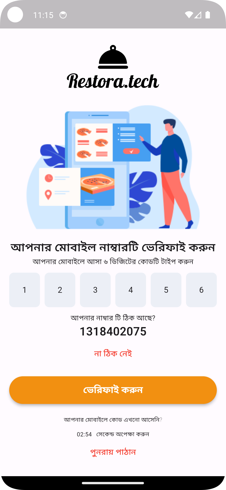 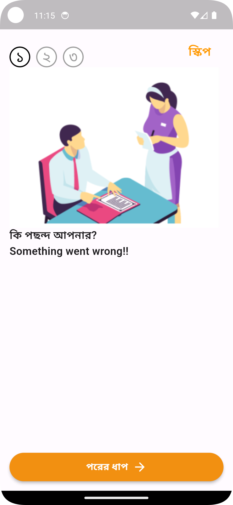 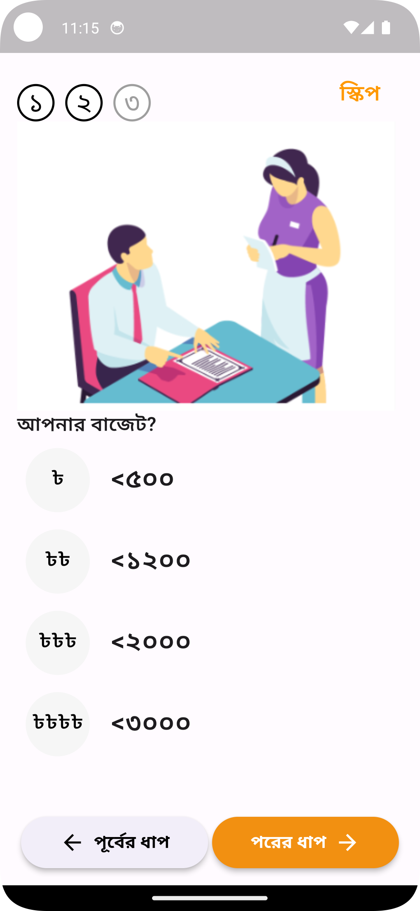
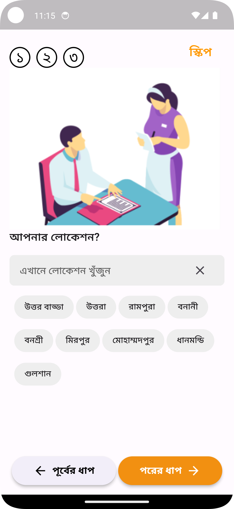 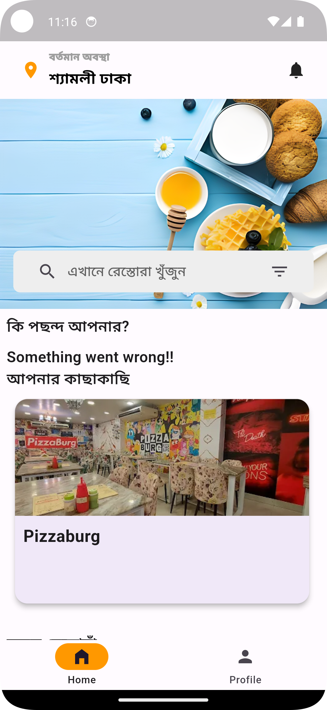 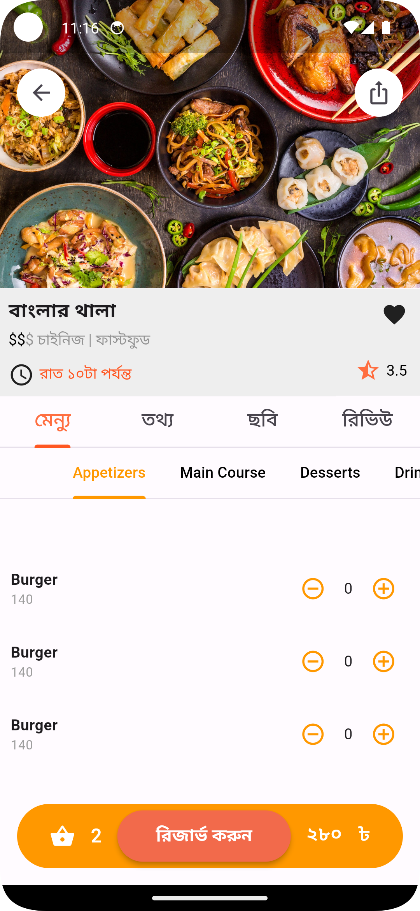 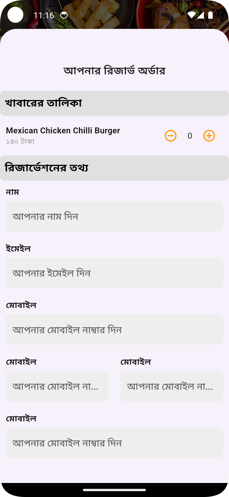
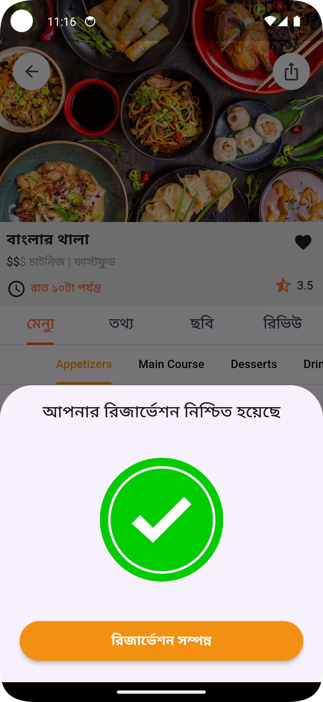  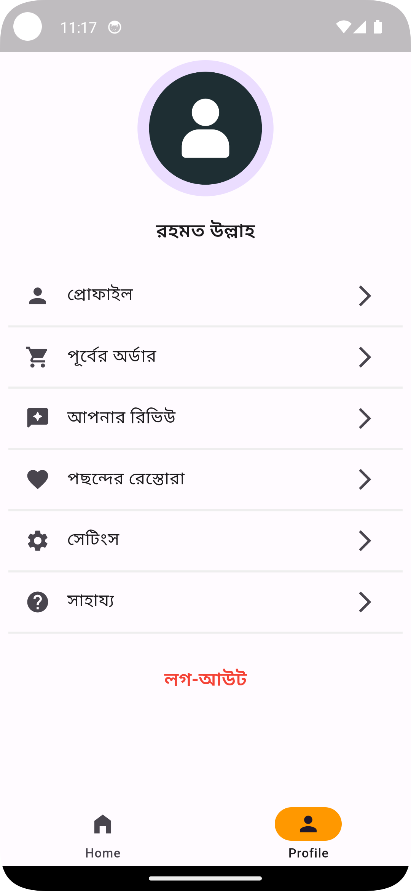 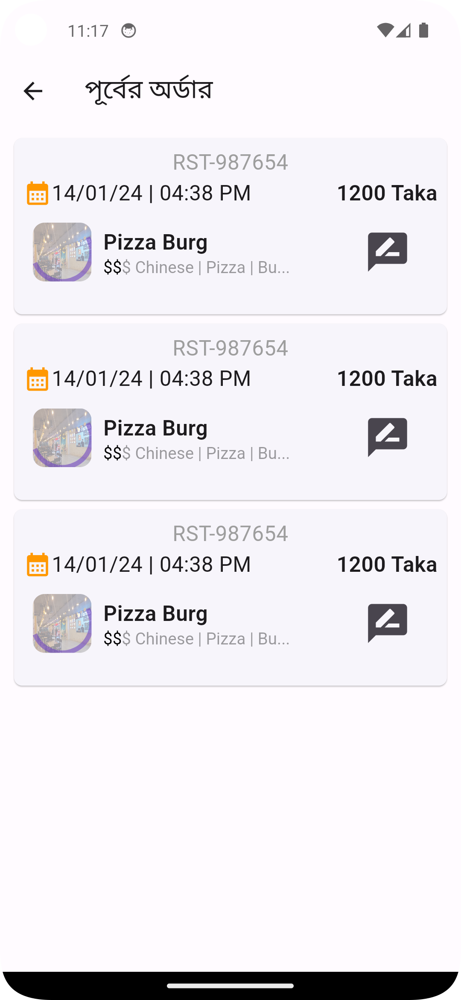
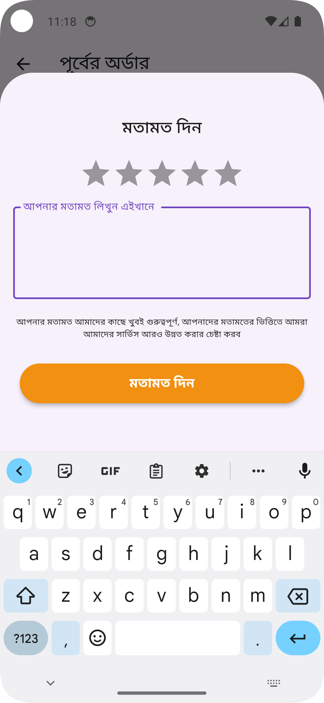 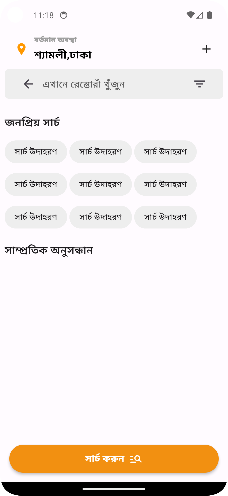 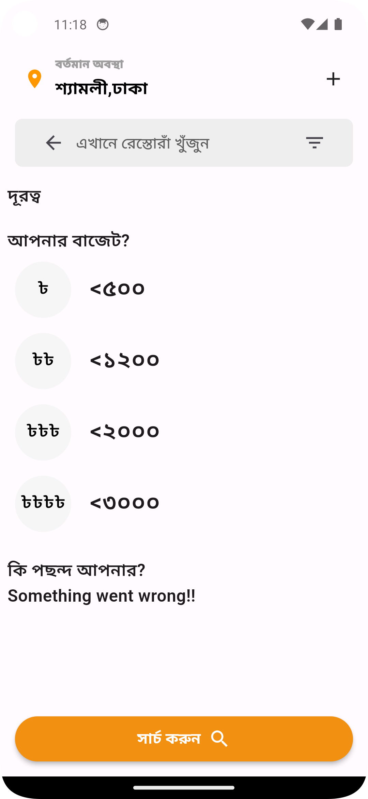 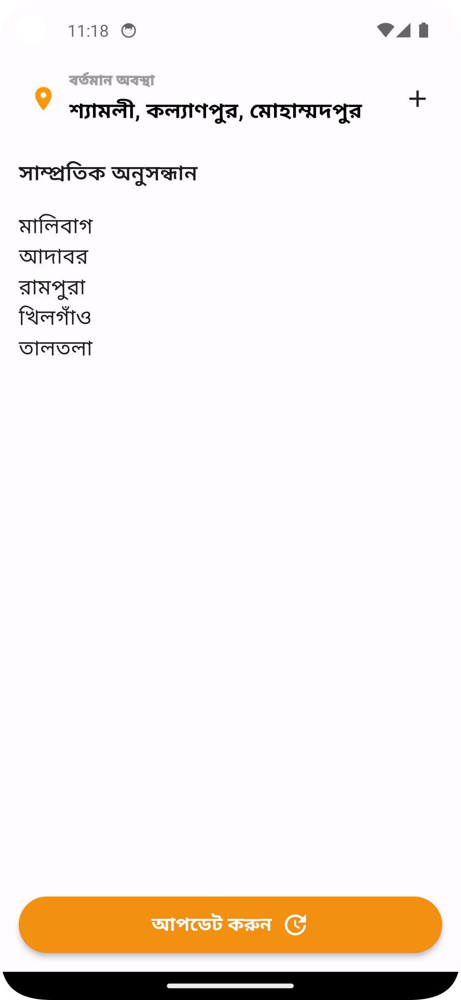

"Redefining Dining Experiences, One Click at a Time!"

Welcome to Restora.tech, a cutting-edge initiative developed by Astha IT's CodeCamp team to transform dining experiences across Bangladesh. Our mission is to address the common challenges faced by food enthusiasts, revolutionizing the entire dining journey from exploration to post-dining feedback.

## Seamless User-Centric Platform

Our platform offers an intuitive mobile app and web interface, catering to diverse user needs with a myriad of features. Explore various cuisines and restaurants, dive into detailed menus, visualize restaurant ambiance, access customer reviews, and effortlessly book tables or place takeout orders. Enjoy the flexibility to modify or cancel bookings at your convenience.

## Empowering Restaurants and Staff

Restora.tech doesn't just cater to diners; it empowers restaurant administrators, managers, waiters, and kitchen staff with dedicated apps and web portals. Efficiently manage orders, menu items, user interactions, and feedback, ensuring a smooth operational flow.

## Streamlined Order Handling

Introducing a robust order handling system that ensures seamless communication between customers, waitstaff, and kitchen personnel. From order placement to customization and payment, every phase is integrated within our app.

## Fostering Improvement through Feedback

At Restora.tech, we're committed to enhancing dining experiences. Beyond digitizing processes, we encourage user feedback, fostering a continuous improvement cycle for both diners and restaurants.

Join us in transforming Bangladesh's dining landscape with our comprehensive, user-friendly platform. Experience a delightful and hassle-free dining journey for all involved stakeholders with Restora.tech.
